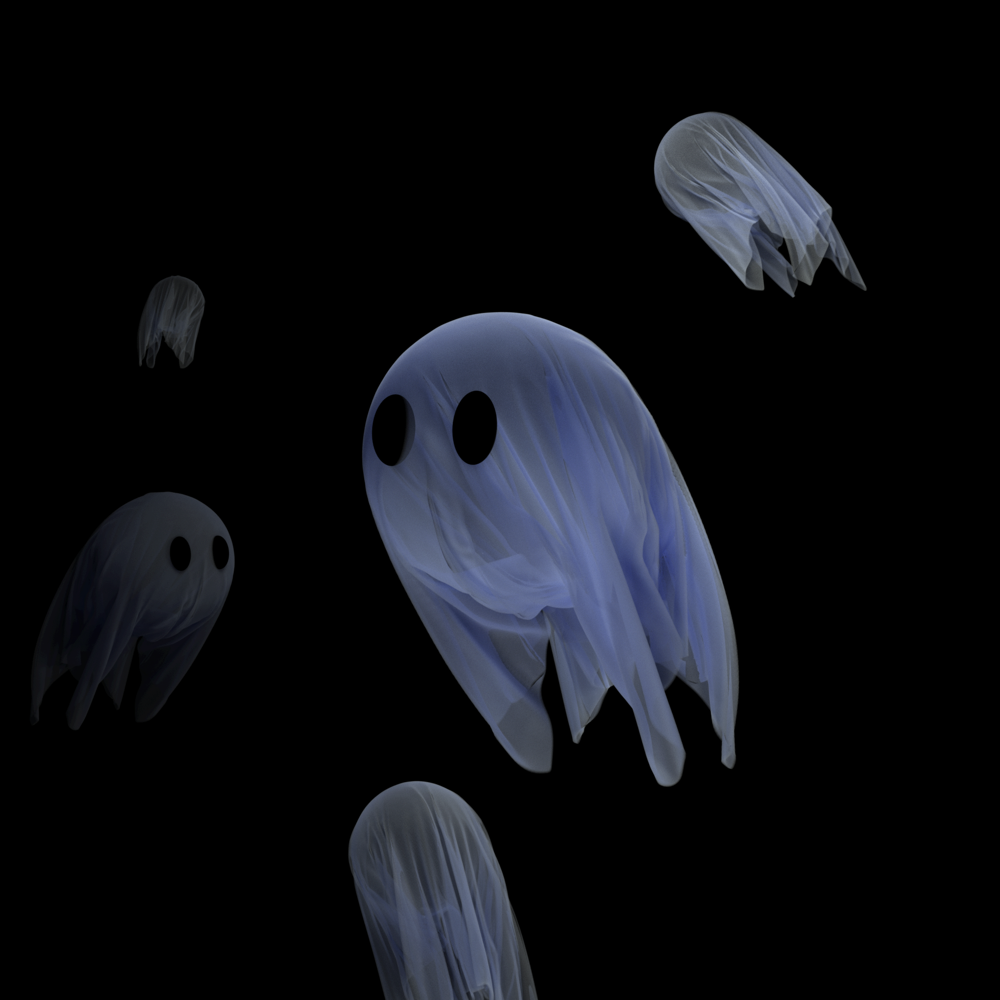

# Volume Renderer

Volume Render with Disney BSDF Implementation on [lajolla renderer](https://github.com/BachiLi/lajolla_public)


# Build
Building is handled by CMake:
```
mkdir build && cd build
cmake -DCMAKE_BUILD_TYPE=Release ..
make -j4
```

# Run
To run, 
```
./lajolla ../scenes/cbox/cbox.xml
```


## Example Renders




